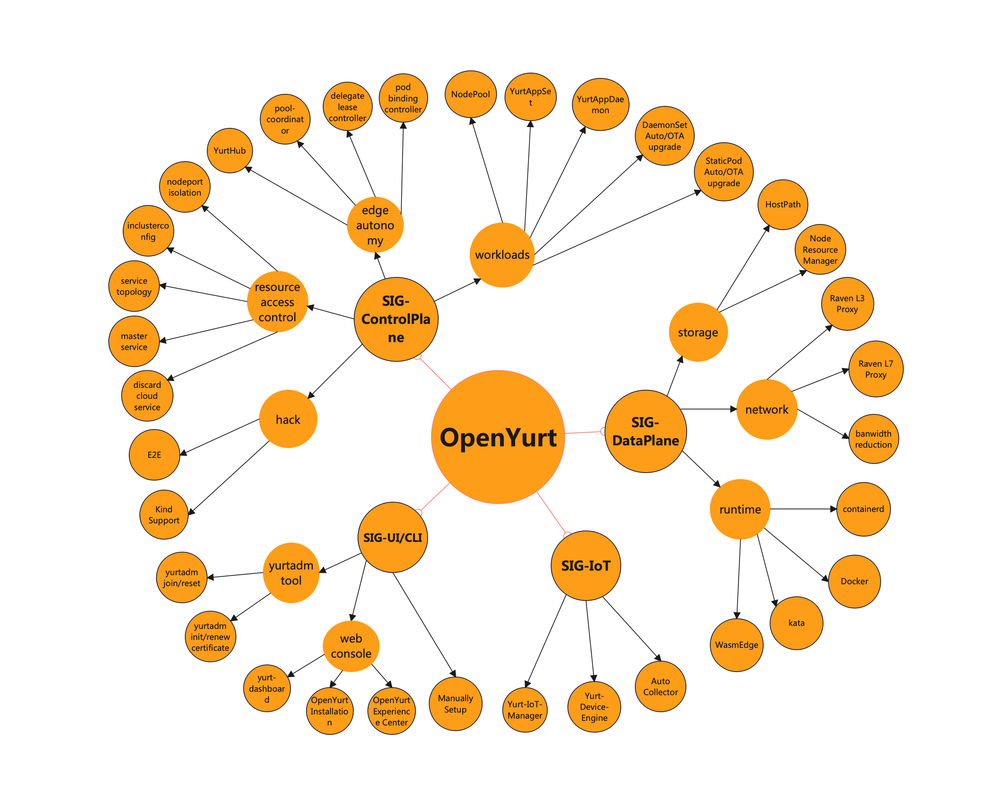

As the number of projects in the OpenYurt community increases, it becomes more and more difficult
to coordinate and synchronize state between projects.

In order to solve the above issues, OpenYurt community discussed and prepared to create Special Interest Groups(SIGs)
to organize and manage the projects. Each SIG will be responsible for a specific topic, such as ControlPlane or DataPlane.

SIGs' Goals are as following:
- Strengthen coordination among OpenYurt projects
- Enable a distributed decision structure and code ownership

### SIGs List

According to the current status of OpenYurt projects, initially we have launched 4 SIGs.
- ControlPlane
- DataPlane
- IoT
- UI/CLI

The projects included in each SIG are shown in the figure below:

### SIG Repos

- ControlPlane

[yurthub](https://github.com/openyurtio/openyurt/tree/master/cmd/yurthub)

[yurt-manager](https://github.com/openyurtio/openyurt/tree/master/cmd/yurt-manager)

[E2E](https://github.com/openyurtio/openyurt/tree/master/test/e2e)

- DataPlane

[Raven](https://github.com/openyurtio/raven)

[Raven Controller Manager](https://github.com/openyurtio/openyurt/tree/master/pkg/controller/gateway)

[Node Resource Manager](https://github.com/openyurtio/node-resource-manager)

- IoT

[Yurt-Device-Controller](https://github.com/openyurtio/yurt-device-controller)

[Yurt-Edgex-Manager](https://github.com/openyurtio/yurt-edgex-manager)

- UI/CLI

[Yurtadm](https://github.com/openyurtio/openyurt/tree/master/cmd/yurtadm)

[Yurt-Dashboard](https://github.com/openyurtio/yurt-dashboard)

[node servant](https://github.com/openyurtio/openyurt/tree/master/cmd/yurt-node-servant)

### SIG Leaders

| SIG Name         | Leaders                                                                                                                                                                                                                                      | Meetings |
|------------------|----------------------------------------------------------------------------------------------------------------------------------------------------------------------------------------------------------------------------------------------| ----------- |
| [ControlPlane]() | * [rambohe-ch](https://github.com/rambohe-ch), alibaba * [Congrool](https://github.com/Congrool), ZheJiang University  * [donychen](https://github.com/donychen1134), meituan  * [huiwq1990](https://github.com/huiwq1990), jdcloud | [APAC Friendly Community meeting](https://calendar.google.com/calendar/u/0?cid=c3VudDRtODc2Y2c3Ymk3anN0ZDdkbHViZzRAZ3JvdXAuY2FsZW5kYXIuZ29vZ2xlLmNvbQ) |
| [DataPlane]()    | * [BSWANG](https://github.com/BSWANG), alibaba * [zzguang](https://github.com/zzguang), Intel * [Cookie](https://github.com/luckymrwang), inspur * [JameKeal](https://github.com/JameKeal), Sangfor                                 | [APAC Friendly Community meeting](https://calendar.google.com/calendar/u/0?cid=c3VudDRtODc2Y2c3Ymk3anN0ZDdkbHViZzRAZ3JvdXAuY2FsZW5kYXIuZ29vZ2xlLmNvbQ) |
| [IoT]()          | * [lwmqwer](https://github.com/lwmqwer), VMware * [gnunu](https://github.com/gnunu), Intel * [wawlian](https://github.com/wawlian), alibaba                                                                                            | [APAC Friendly Community meeting](https://calendar.google.com/calendar/u/0?cid=c3VudDRtODc2Y2c3Ymk3anN0ZDdkbHViZzRAZ3JvdXAuY2FsZW5kYXIuZ29vZ2xlLmNvbQ) |
| [UI/CLI]()       | * [luc99hen](https://github.com/luc99hen), TongJi University * [YTGhost](https://github.com/YTGhost), ZheJiang University                                                                                                                 | [APAC Friendly Community meeting](https://calendar.google.com/calendar/u/0?cid=c3VudDRtODc2Y2c3Ymk3anN0ZDdkbHViZzRAZ3JvdXAuY2FsZW5kYXIuZ29vZ2xlLmNvbQ) |

